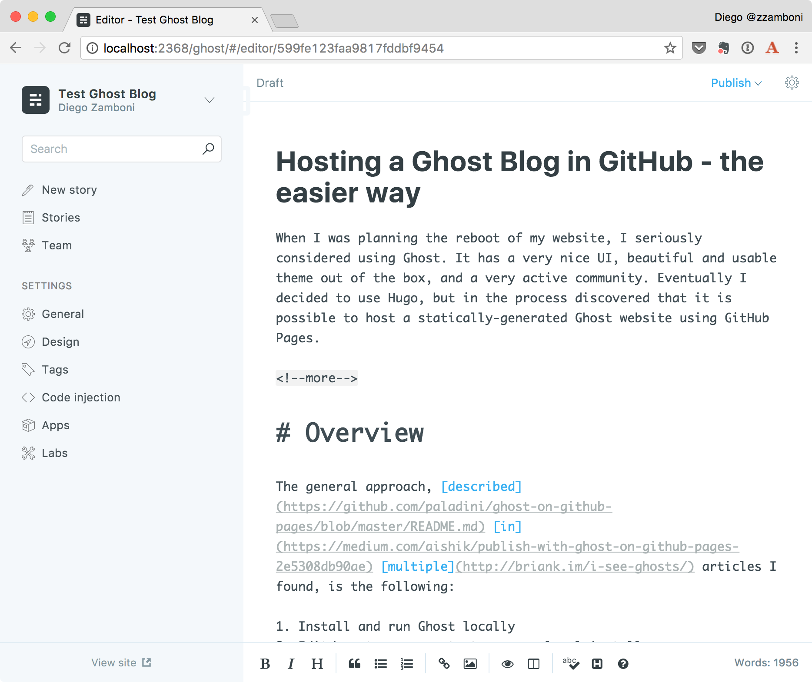
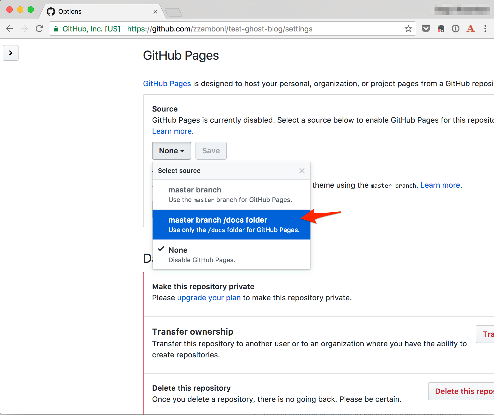

+++
title = "Hosting a Ghost Blog in GitHub - the easier way"
author = ["Diego Zamboni"]
summary = "When I was planning the reboot of my website, I seriously considered using Ghost. It has a very nice UI, beautiful and usable theme out of the box, and a very active community. Eventually I decided to use Hugo, but in the process discovered that it is possible to host a statically-generated Ghost website using GitHub Pages."
date = 2017-08-25T09:00:00+02:00
tags = ["howto", "ghost", "github", "blogging"]
draft = false
creator = "Emacs 26.2 (Org mode 9.2.4 + ox-hugo)"
toc = true
featured_image = "/images/ghost-plus-github2.png"
slug = "hosting-a-ghost-blog-in-github"
+++

When I was planning the reboot of my website, I seriously considered using Ghost. It has a very nice UI, beautiful and usable theme out of the box, and a very active community. Eventually I decided to use Hugo, but in the process discovered that it is possible to host a statically-generated Ghost website using GitHub Pages.


## Overview {#overview}

The general approach, [described](https://github.com/paladini/ghost-on-github-pages/blob/master/README.md) [in](https://medium.com/aishik/publish-with-ghost-on-github-pages-2e5308db90ae) [multiple](http://briank.im/i-see-ghosts/) articles I found, is the following:

1.  Install and run Ghost locally
2.  Edit/create your content on your local install
3.  Create a static copy of your Ghost site by scraping it off the local install.
4.  Push the static website to GitHub Pages

So far, so good. It makes sense. But all those articles share one thing: they suggest using a tool called [buster](https://github.com/axitkhurana/buster) which, as far as I can tell, it's a web-scraping tool, specialized for Ghost. However, it has a number limitations--for example, it does not slurp Ghost static pages, and it hasn't been updated in a very long time (there's [a fork](https://github.com/skosch/buster) with somewhat more recent activity).

I found the use of buster puzzling, since there is a perfectly mature, functional and complete tool for scraping off a copy of a website: good old trusty [wget](https://en.wikipedia.org/wiki/Wget). It is included (or easily available) in most Unix/Linux distributions, it is extremely powerful, and has features that make it really easy to create a local, working copy of a website (including proper translation of URLs). I used it to create the [static archive of my old blog, BrT](http://briank.im/i-see-ghosts/), when I decided to retire its WordPress backend years ago.

Another thing I found is that most instructions suggest storing only the generated website in your GitHub repository. I prefer keeping the source files and the generated website together. GitHub pages allows serving the website [from different sources](https://help.github.com/articles/configuring-a-publishing-source-for-github-pages/), including the repo's `gh-pages` branch, its `master` branch, or the `/docs` directory in the `master` branch.  Personally, I prefer using the `/docs` directory since it allows me to keep both the source and the generated website in the same place, without any branch fiddling.

So, without further ado, here are the detailed instructions. I ran these on my Mac, but most of them should work equally well on Linux or any other Unix-like system.


## Install Ghost {#install-ghost}

1.  [Download Ghost](https://ghost.org/developers/) (version 1.7.1 as of this writing):

    ```console
    cd ~/tmp # or some other suitable place
    wget https://github.com/TryGhost/Ghost/releases/download/1.7.1/Ghost-1.7.1.zip
    ```

2.  Unpack it in a suitable directory, initialize it as a GitHub repository and commit the Ghost plain install (to have a baseline with the fresh install):

    ```console
    mkdir test-ghost-blog
    cd test-ghost-blog
    unzip ../Ghost-1.7.1.zip
    git init .
    git add .
    git commit -m 'Initial commit'
    ```

3.  Install the necessary Node modules, update the git repository:

    ```console
    npm install
    git add .
    git commit -m 'Installed Node dependencies'
    ```

4.  Install `knex-migrator`, needed for the DB initialization:

    ```console
    npm install -g knex-migrator
    ```

5.  Initialize the database and start Ghost (`knex-migrator` may give a  "Module version mismatch" message, but it seems to work OK anyway):

    ```console
    knex-migrator
    npm start
    ```

6.  Your blog is running! You can visit it at <http://localhost:2368/>:
    

7.  Go to <http://localhost:2368/ghost>, create your user and set up your blog info:
    

    {}You may want to use an email address you don't mind being public. See "[Security Considerations](#security-considerations)" below.{}

8.  You can now start creating content  and configuring the local Ghost instance.
    

9.  When you have things the way you like them, you can commit the changes to the git repository:

    ```text
    git add .
    git commit -m 'Finished local Ghost setup'
    ```


## Export website {#export-website}

Now that you have your blog set up locally, we need to generate a static copy that can be published to GitHub. For this we will use the `wget` command. I gathered the correct options from [this blog post by Ilya](http://www.suodatin.com/fathom/How-to-retire-a-wordpress-blog-(make-wordpress-a-static-site)) a few years ago, although it's not too hard to deduct them from the [wget man page](http://www.misc.cl.cam.ac.uk/cgi-bin/manpage?wget).

1.  We will publish the blog from the `docs` directory of our repository, so that's where we need to store the static copy:

    ```console
    wget -r -nH -P docs -E -T 2 -np -k http://localhost:2368/
    ```

    This command will crawl the entire site and create a static copy of it under the `docs` directory. You can open the file `docs/index.html` in your web browser to verify.

2.  Add the generated pages to the git repository:

    ```console
    git add docs
    git commit -m 'Initial commit of static web site'
    ```


## Push to GitHub {#push-to-github}

We can finally create our GitHub repo and push the contents to it.

1.  Create the repository. I'm using here the [`hub`](https://hub.github.com/) command, but of course you can also do it by hand in the GitHub website (in this case you need to [add the git remote](https://help.github.com/articles/adding-a-remote/) by hand as well):

    ```console
    hub create
    ```

2.  Push the local repository to GitHub (this includes both the Ghost source and the generated website under `docs`):

    ```console
    git push -u origin master
    ```


## Publish! {#publish}

Now all we need to do is enable [GitHub Pages](https://pages.github.com/) on our repository, so that the contents under `docs` gets published.

1.  Go to your repository's "Settings" screen:
    

2.  Scroll down to the "GitHub Pages" section, choose the "master branch /docs folder" option and click the "Save" button:
    

We are done! After a few minutes (usually takes 2-5 minutes for the contents to be published the first time, afterwards updates are nearly instantaneous), you will find your new website's content under `http://<github-username>.github.io/<github-repo-name>`. In our example, the URL is <https://zzamboni.github.io/test-ghost-blog/>:




## The update workflow {#the-workflow}

After the initial setup, you need to follow these steps when you want to update your website:

1.  Start Ghost inside your GitHub repository:

    ```console
    npm start
    ```

2.  Connect to <http://localhost:2368/> and update your contents. You can also change the blog settings, themes, etc.

3.  Re-crawl the site to generate the local copy:

    ```console
    wget -r -nH -P docs -E -T 2 -np -k http://localhost:2368/
    ```

4.  Update and push the whole git repository:

    ```console
    git add .
    git commit -m 'Website update'
    ```

Steps 3 and 4 can be easily automated. I keep the following [`update_website.sh`](https://github.com/zzamboni/test-ghost-blog/blob/master/update%5Fwebsite.sh) script in the repository:

```sh
#!/bin/bash
OUTDIR=docs
LOCAL_GHOST="http://localhost:2368/"
wget -r -nH -P $OUTDIR -E -T 2 -np -k $LOCAL_GHOST && \
git add . && \
git ci -m 'Update website' &&  \
git push
```

Then you can just run this script from within your repository after making any changes:

```console
./update_website.sh
```


## Variations {#variations}

The method described above is my favorite because it allows me to keep the source data and generated pages in the same repository. However, there are other variations that you might want to use:

-   If your repository is named `<username>.github.io`, you cannot configure GitHub Pages to serve content from the `/docs` directory, it is automatically served from the root directory of the `master` branch. In this case you need to store only the generated pages in the repository (you could also reverse the setup: have the generated website in the root directory, and the local Ghost install under the `/source` directory).

-   You can choose to serve contents from the `gh-pages` branch instead of the `/docs` directory. This allows you to keep the source and output still in the same repository. You will need to switch from one branch to the other between updating the contents and generating the static web site (you may need to keep both branches in different directories, so that your local Ghost install can still access its database in the `master` branch while you fetch it to generate the static website).

You can read more about the different ways to serve GitHub Pages content in the [GitHub documentation](https://help.github.com/articles/configuring-a-publishing-source-for-github-pages/).

You can use the same method to host your static content somewhere other than GitHub pages.


## Security considerations {#security-considerations}

One of the most-touted benefits of a static website (also known, I discovered recently, as the [JAMstack](https://jamstack.org/)) is security -- without server-side active components, it's much harder for a website to be compromised.

Sharp-eyed readers may have noticed that with the setup described above, Ghost's entire database file gets checked into your repository. This file contains not only your published blog posts, but also your user definitions (including hashed versions of the user passwords) and draft posts.

The local Ghost install uses a SQLite database, stored at `content/data/ghost-dev.db`, which you can query using the `sqlite3` command. For example, to see the user definitions:

```console
sqlite3 content/data/ghost-dev.db 'select * from users'
```

While this seems scandalous, keep in mind that the active Ghost installation is only running locally on your machine, and is not accessible to anyone from the outside, even when it is running (the server is only bound to `localhost`). Still, you may want to keep in mind:

-   Your name and email address are accessible. Your name is visible in any posts you write, but you may want to set your email address to one you don't mind being public.
-   Don't use a password that you also use in any other place (**this is a good security recommendation in general**). The password is hashed, but this prevents the password from being useful even if someone manages to figure it out.
-   If you share your machine with others, keep in mind that any other local users **will** be able to access your local Ghost install as long as it's running. If you don't trust those users, make sure you set a good password and shut it down when you are not using it.
-   To prevent the problem altogether, add `content/data/ghost-dev.db` to your `.gitignore` file so it does not get checked into the repository. Make sure you make a backup of it separately so you can recover your blog in case of local data loss.


## Conclusion {#conclusion}

I followed the steps described above to create a test Ghost install, which you can access at <https://zzamboni.github.io/test-ghost-blog/>, and its corresponding GitHub repository at <https://github.com/zzamboni/test-ghost-blog/>. You can also find this article [published there](https://zzamboni.github.io/test-ghost-blog/hosting-a-ghost-blog-in-github-the-easier-way/).

I hope you've found it useful. I'd love to hear your comments!
