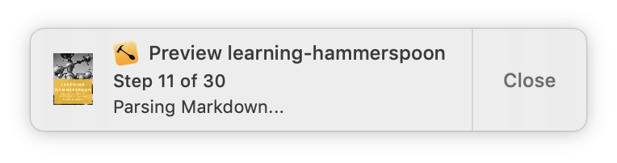

+++
title = "Automating Leanpub book publishing with Hammerspoon and CircleCI"
author = ["Diego Zamboni"]
date = 2019-04-16T11:25:00+02:00
tags = ["writing", "hammerspoon", "circleci", "automation", "leanpub", "github"]
draft = false
creator = "Emacs 28.2 (Org mode 9.7.11 + ox-hugo)"
toc = true
featured_image = "/images/hammerspoon-github-circleci-leanpub.001.jpg"
+++

I am the author of two books: [_Learning CFEngine_](https://cf-learn.info/) and [_Learning Hammerspoon_](https://leanpub.com/learning-hammerspoon), both self-published using [Leanpub](https://leanpub.com/). The source of my books is kept in GitHub repositories. In this post I will show you how I use the [Leanpub API](https://leanpub.com/help/api) together with [Hammerspoon](https://www.hammerspoon.org/)  and [CircleCI](https://circleci.com) as part  of my workflow, to automate and monitor the building, previewing and publishing of my books.



{}
The Hammerspoon section of this post is Mac-specific (since Hammerspoon is a Mac-only application), but the integration between GitHub, CircleCI and Leanpub can be applied regardless of the OS you use.
{}


## Leanpub basics {#leanpub-basics}

First, some basic concepts about the Leanpub API. See the [documentation](https://leanpub.com/help/api) for the full details, I'm only mentioning clear some things you need to know to understand the rest of this post.

-   **Book slug**: Each Leanpub book is identified by a _slug_, which is basically an unique author-chosen identifier for the book. The book slug is included in the book's Leanpub URL. For example, the URL for _Learning Hammerspoon_ is <https://leanpub.com/learning-hammerspoon>, therefore its slug is `learning-hammerspoon`. The slug can be changed by the author as part of the book configuration, and is used in all the API calls to identify the book for which an operation should be performed.

    {}
    The tools I describe below assume by default that your book's git repository name is the same as its Leanpub slug. You can specify it if this is not the case by providing some additional configuration parameters.
    {}
-   **API key**: Every Leanpub author gets an [_API key_](https://leanpub.com/help/api#getting-your-api-key), which is a randomly-generated string of characters which is used as an authentication token. The API key needs to be provided on most Leanpub API  calls (some query operations are allowed without a key).
-   **Build types**: The Leanpub API allows you to trigger several types of [build operations](https://leanpub.com/help/api#previewing-and-publishing) on a book:
    -   _Preview_ builds all the formats supported by Leanpub (PDF, ePub, Mobi), using the whole book as defined in the `Book.txt` file.
    -   _Subset preview_ builds only the PDF version of a book, from a subset of files defined in the `Subset.txt` file in your repository.
    -   _File preview_ builds only a segment of text you need to provide as part of the API call. I do not use this operation in my workflows.
    -   _Publish_ builds and publishes a new version of the book. Publishing means that it becomes the version available for purchase. Optionally, when publishing a new release you can send out an email with release notes to people who have already purchased the book (in any case, the new version of the book also becomes available for them to download).
-   **Book writing mode** refers to the source from which Leanpub gets the text for your book. I use "Git and Github", but these techniques should work equally well with BitBucket or any other platforms that can trigger a webhook when your text is updated.


## The beginning: triggering and watching builds by hand {#the-beginning-triggering-and-watching-builds-by-hand}

{}
This is not part of my final workflow and you can safely skip it. It is only a bit of historic perspective for how my workflow evolved.
{}

As an initial step, I wrote some shell scripts to trigger and watch the progress of Leanpub builds by hand. I use the [Elvish shell](https://elv.sh), and my scripts are published as the [leanpub](https://github.com/zzamboni/elvish-modules/blob/master/leanpub.org) Elvish module. These allow you to  trigger book builds (only preview and subset builds, no publishing) by hand, and also to watch the progress of any operation. If you use Elvish, you can install the module like this:

```elvish
  use epm
  epm:install github.com/zzamboni/elvish-modules
  use github.com/zzamboni/elvish-modules/leanpub
```

Then, whenever you commit changes to your text, you can trigger a build and watch its progress like this:

```elvish
leanpub:preview # or leanpub:subset
leanpub:watch
```

You can combine build-and-watch in a single command:

```elvish
leanpub:preview-and-watch
leanpub:subset-and-watch
```

{}
If your current directory name is not the same as your book slug, you can pass the book slug as an argument. For example:

```elvish
leanpub:preview-and-watch my_book
```
{}

After a while using these scripts, I thought I would put some work on improving both the aesthetics and the functionality of my automation. The next sections are what I came up with.


## Watching build activity with Hammerspoon {#watching-build-activity-with-hammerspoon}

The first step is to get rid of the need to run those "watch" scripts, which produce raw JSON output from the Leanpub API, and use nice macOS notifications to track the activity, like these:




These are produced by a [Spoon](/post/using-spoons-in-hammerspoon/) I wrote called [Leanpub](https://www.hammerspoon.org/Spoons/Leanpub.html). You can install, load and configure it using the [SpoonInstall](/post/using-spoons-in-hammerspoon/#automated-spoon-installation-and-configuration) spoon.

{}
If you want to learn how this Spoon is implemented, please check out the "Writing your own extensions and Spoons" chapter in [_Learning Hammerspoon_](https://leanpub.com/learning-hammerspoon).
{}

For example, in my configuration I have [the following code](/post/my-hammerspoon-configuration-with-commentary/#leanpub-integration) to configure the spoon to watch for both of my books:

```lua
  Install:andUse("Leanpub",
                 {
                   config = {
                     -- api_key = "my-api-key",
                     watch_books = {
                       { slug = "learning-hammerspoon" },
                       { slug = "learning-cfengine" }
                     }
                   },
                   start = true
  })
```

Note that you also need to specify your Leanpub API key, which you can get and manage in the Author / Your API Key in Leanpub:



{}
You can specify the `api_key` value in the main declaration as shown (commented) above. However, be careful if you keep your configuration file in GitHub or some other publicly-accessible place. What I do is keep a separate file called `init-local.lua` which I do not commit to my git repository, and where I set my API key as follows:

```lua
  -- Leanpub API key
  spoon.Leanpub.api_key = "my-api-key"
```

This file in turn gets loaded into my main config file [as follows](/post/my-hammerspoon-configuration-with-commentary/#loading-private-configuration):

```lua
  local localfile = hs.configdir .. "/init-local.lua"
  if hs.fs.attributes(localfile) then
    dofile(localfile)
  end
```
{}

Reload your Hammerspoon configuration. Now when you trigger a preview or publish (for example, using the scripts above), you will after a few seconds start seeing the corresponding notifications.

{}
Note that the actual behavior and appearance of the notifications produced by Hammerspoon (like those of any other application) depend partly on the settings you have in the macOS Notifications control panel. For example, if you don't see any notifications, make sure the Hammerspoon notifications are not blocked and that you have not enabled "Do not disturb" mode. If you don't see any buttons in the notifications, it may indicate that you have the Hammerspoon alert style set to "Banners" instead of "Alerts".
{}


## Triggering builds with a static webhook {#triggering-builds-with-a-static-webhook}

The most basic way of automatically triggering builds is by using a webhook to trigger the Leanpub API directly. This is described in  your book's "Getting Started" page, which you can access at `https://leanpub.com/YOUR_BOOK/getting_started` (replacing `YOUR_BOOK` with your book's slug). This works well, but the downside is that the webhook is "hardcoded" so you can only trigger a fixed type of build per webhook (e.g. subset or regular preview). This means that if you want to trigger a different type of build, you need to keep multiple webhooks defined, and activate the one you want by hand:



{}
If you only want to automatically trigger one type of build then you don't need to do anything else. Continue reading if you are interested in a flexible workflow which allows you to trigger different types of builds based on tags you define on your book's repository.
{}


## Triggering builds via CircleCI {#triggering-builds-via-circleci}

Looking for ways to further automate the preview and publish workflow of my books, I came across [CircleCI](https://circleci.com), a popular CI/CD platform which is easy to use and allows creation of libraries called "orbs" to encapsulate more complex behaviors. I wrote an orb called [zzamboni/leanpub](https://circleci.com/orbs/registry/orb/zzamboni/leanpub) for automating interactions with the Leanpub API. With it, you can set up a build/preview/publish workflow which you can trigger directly from git.

Here's my preferred workflow (you can build others as well using the leanpub orb, see below for ideas):

-   A _subset preview_ is triggered for every commit to the book's repository. I keep `Subset.txt` with the same content as `Book.txt`, so a subset preview gives me a PDF-only build of my whole book (you could also modify `Subset.txt` before each commit depending on the part of the book you want to preview, but this is outside the scope of this article). This allows me to have a continuous PDF preview of any changes I make to my book.
-   A _regular preview_ is triggered for commits that are tagged with a tag starting with `preview`. This builds the book in all the formats supported by Leanpub (PDF, epub, mobi). This allows me to check the output in all formats when I'm doing finishing touches before publishing a new version of the book, or when I make major changes.
-   A _silent publish_ is triggered for commits tagged with a tag starting with `silent-publish`. This builds and publishes the book, but without sending out release notes. I use this for "minor" updates to the published book which I don't think need to be widely announced (e.g. fixing typos and formatting, etc.)
-   Finally, a _publish_ is triggered for commits tagged with a tag starting with `publish`. This builds and publishes the book, but also sends out release notes to its readers. The release notes are taken from the description of the tag (if it is an annotated tag) or from the commit message of the tagged commit (if it's a regular tag).

To implement this workflow, all you have to do is add a file `.circleci/config.yml` to your repository, containing the following:

```yaml
  version: 2.1

  orbs:
    leanpub: zzamboni/leanpub@0.1.1

  # This tag-based book building workflow dispatches to the correct job
  # depending on tagging
  workflows:
    version: 2
    build-book:
      jobs:
        - leanpub/subset-preview:
            filters:
              tags:
                ignore:
                  - /^preview.*/
                  - /^publish.*/
                  - /^silent-publish.*/
        - leanpub/full-preview:
            filters:
              tags:
                only: /^preview.*/
              branches:
                ignore: /.*/
        - leanpub/auto-publish:
            name: leanpub/silent-publish
            auto-release-notes: false
            filters:
              tags:
                only: /^silent-publish.*/
              branches:
                ignore: /.*/
        - leanpub/auto-publish:
            auto-release-notes: true
            filters:
              tags:
                only: /^publish.*/
              branches:
                ignore: /.*/
```

{}
The `leanpub` orb defines the "jobs" to trigger the different types of builds, but the logic regarding tags  is defined in the `worflows:` section of the config file, by selecting or ignoring them according to our previous description. You can choose your own tags, or do the workflow based on branch names, or any other condition you want.
{}

{}
The default config assumes that your git repository name corresponds to the book slug. If this is not the case, you have to add a `book-slug` parameter to all the job calls in the config file. See the [orb documentation](https://circleci.com/orbs/registry/orb/zzamboni/leanpub) for details.
{}

Once you have committed this file, you can enable CircleCI on it as follows:

-   If you have defined static webhooks in your repository as described before, make sure to disable them.
-   Login at <https://circleci.com/> using your GitHub account.
-   In the "Add projects" screen, choose your repository and click  "Set Up Project".  Since you have  already added the `config.yml` file,  you can skip  that part and click on "Start building".
-   The first build will fail because you have not provided your Leanpub API key yet:
    
-   To fix this, you need to define an environment variable called `LEANPUB_API_KEY` within your CircleCI project. Click on the project name, and then on the settings button at the top-left of the screen. Once there, select the "Environment Variables" section and enter the environment variable:
    
-   Now you can go to the "Workflows" screen and click on "Rerun" for your book's workflow (alternatively, make a new commit on your git repository). Assuming you have the Leanpub Spoon installed as described before, you should see the notifications for your book's build within a few seconds.
    


## Conclusion {#conclusion}

Using the techniques described above has made my book building and publishing much easier. I have been using them for a few weeks, and the [latest release of _Learning Hammerspoon_](https://zzamboni.org/post/new-release-of-learning-hammerspoon-is-out/) was published using this workflow already. I hope you find it useful as well! Please let me know  in the comments if you have any questions or feedback.
