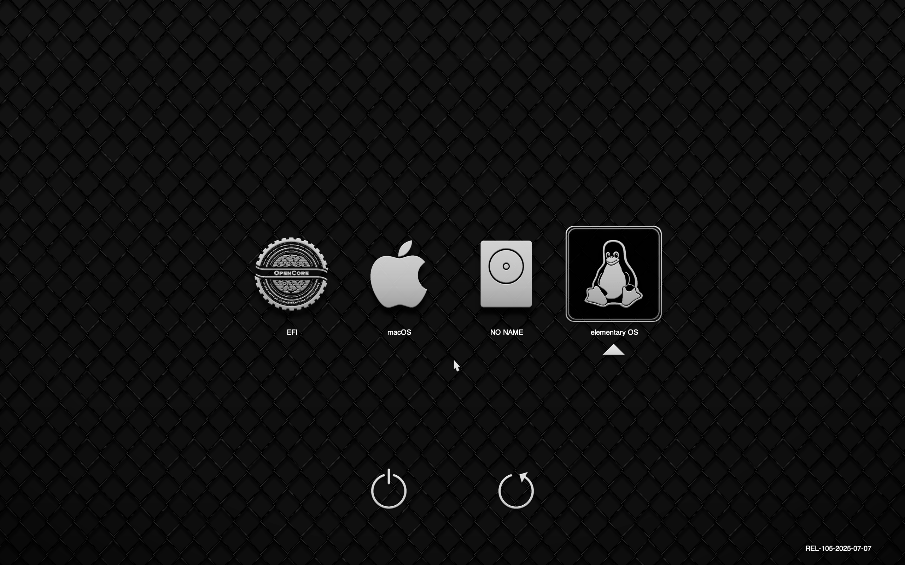

+++
title = "Reviving an old Mac with Linux (part 2 - prettifying boot)"
author = ["Diego Zamboni"]
summary = "Improve your Mac/Linux dual boot setup with pretty boot screens!"
date = 2025-10-18T20:24:00+02:00
tags = ["howto", "mac", "linux", "opencore", "oclp"]
draft = false
creator = "Emacs 29.3 (Org mode 9.7.34 + ox-hugo)"
featureimage = "img/20251001-230259_OC-dual-boot-screen.png"
toc = true
+++

In the [previous post](), we saw the steps to install Linux in a dual-boot setup on an old Mac, using OpenCore as the boot manager.

However those icons are fairly generic, and there are a couple of spurious entries there introduced by default by OpenCore. Let's make it prettier.




## Prettifying the OpenCore boot screen {#prettifying-the-opencore-boot-screen}

The [OpenCore](https://dortania.github.io/OpenCore-Install-Guide/) boot loader "is a complex piece of software" (in its own words). It's extensively documented but works reasonably well with defaults. You may need to refer to its [Configuration guide](https://dortania.github.io/docs/) for most advanced use cases. For what we want here, see [OpenCore beauty treatment](https://dortania.github.io/OpenCore-Post-Install/cosmetic/gui.html#setting-up-opencore-s-gui), but I've extracted the main steps below.

First, we can configure the OpenCore theme. You can find links to many nice themes at [OpenCanopy Gallery](https://dortania.github.io/OpenCanopy-Gallery/). The [Acidanthera themes](https://dortania.github.io/OpenCanopy-Gallery/ocbinary.html) are included with OpenCore, but I personally like the [Blackosx themes](https://dortania.github.io/OpenCanopy-Gallery/blackosx.html#themes). The one I'm currently using is [BsxDarkFenceLight1](https://github.com/blackosx/BsxDarkFenceLight1). Here's how to install and configure a theme:

1.  Make sure the OpenCore EFI partition is mounted. It should normally be `/dev/sda1`. Depending on how you installed Linux (e.g. if you installed Ubuntu), it may already be mounted as `boot/efi`. If you installed Elementary OS and created a second EFI partition, you'll need to explicitly mount it:
    ```bash
       sudo mkdir /mnt/OC_EFI; sudo mount /dev/sda1 /mnt/OC_EFI
    ```
2.  Download the theme you want to use - either clone the git repository or download and unpack its zip file.
    ```bash
       git clone https://github.com/blackosx/BsxDarkFenceLight1.git
    ```
3.  Copy the theme under `EFI/OC/Resources/Image/` in the EFI partition, creating both the top- and sub-directory. For example:
    ```bash
       sudo rsync -v BsxDarkFenceLight1/Blackosx /mnt/OC_EFI/EFI/OC/Resources/Image/
    ```
4.  Edit `EFI/OC/config.plist` to point at the theme you want to try. You need to modify the Misc/PickerVariant attribute. You can use your favorite plist editor, but for such a simple change you can just edit it as a text file, find `PickerVariant` and edit directly. You need to specify the top/sub directories of the theme you want to use. For example:
    ```xml
                   <key>PickerVariant</key>
                   <string>Blackosx\BsxDarkFenceLight1</string>
    ```
5.  Reboot! You should now see the new theme in action, but still with the extra icons, and with the default Penguin icon for Linux:
    

Removing and customizing those extra icons took a bit of experimentation. The key is in using `.contentVisibility` files to hide the undesired icons, and `.contentFlavour` files to define the icon to use (these files are described in the full OpenCore Configuration guide mentioned above):

-   Find all the `.contentFlavour` files under all your EFI partitions (`/mnt/OC_EFI` and `/boot/efi` in our example so far) that contain "OpenCore". In those same directories, create a `.contentVisibility` file containing the string `Disabled`. You may also need to add them to other directories where `.efi` files are located. In my case I had these:
    ```bash
      echo Disabled | sudo tee /mnt/OC_EFI/System/Library/CoreServices/.contentVisibility
      echo Disabled | sudo tee /boot/efi/EFI/BOOT/.contentVisibility
    ```
-   Reboot and adjust as needed until you only have the icons you want.
-   The Apple icon seems to be hardcoded, but to customize the icon for the Linux partition you can create a `.contentFlavour` file in the directory from which Linux is booted (in Elementary OS this is `/boot/`, in Ubuntu it was `/boot/efi/EFI/ubuntu`). The contents of the file should match the basename of one of the icons in the OpenCore theme you are using. The Blackosx icon sets include a vast number of icons for most common Linux distributions, including Elementary OS. So in my case I had to do the following:
    ```bash
      echo ElementaryOS | sudo tee /boot/.contentFlavour
    ```
-   Reboot and enjoy your new clean boot screen!
    [](images/20251001-230259_OC-dual-boot-screen.png)
-   Bonus tip: to configure the default boot entry, just select it and press `Ctrl-Enter` - the choice will be remembers in future boots.


## Prettifying the Linux boot screen. {#prettifying-the-linux-boot-screen-dot}

Most Ubuntu-based distributions (and maybe others) these days use [Plymouth](https://wiki.ubuntu.com/Plymouth#Splash_Theme) as their boot-screen manager. Plymouth is a bit of a dark art - it's somewhat documented but a lot of trial and error is still needed. In elementary OS, by default you will see the following boot screen:



It's not bad, but I prefer something a bit more Mac-like, with the logo not so big, and a progress bar at the bottom. Here's what my boot screen looks like:



And here's how to achieve it:

1.  Clone the [mac-like](https://github.com/zzamboni/mac-like) repository:
    ```bash
       git clone https://github.com/zzamboni/mac-like
    ```
2.  Copy the `mac-like` directory to `/usr/share/plymouth/themes`:
    ```bash
       sudo cp -a mac-like /usr/share/plymouth/themes/
    ```
3.  The theme comes with the elementary OS logo by default. If you want to change it, you need to replace the `header-image.png` file with the logo you want to use. You can use whatever logos you want. What I did was to reuse the logos from the OpenCore theme (for example, my eOS logo comes from [BsxDarkFenceLight1](https://github.com/blackosx/BsxDarkFenceLight1), before I was using the Ubuntu logo from the same theme). The OpenCore icons include the logos in Apple's ICNS format, but Plymouth expect the images in PNG, so you need to convert it. You can do it locally with something like Gimp, or online. For example, I have used <https://www.coolutils.com/online/ICNS-to-PNG> and it works well. Once you have your logo converted, copy it to `/usr/share/plymouth/themes/header-image.png`.
4.  You need to register the new theme with Ubuntu's alternatives system:
    ```bash
       sudo update-alternatives --install /usr/share/plymouth/themes/default.plymouth default.plymouth /usr/share/plymouth/themes/mac-like/mac-like.plymouth 100
    ```
5.  Choose the new theme as default (choose the appropriate number for `mac-like` in the list that appears):
    ```bash
       sudo update-alternatives --config default.plymouth
    ```
6.  Regenerate initramfs:
    ```bash
       sudo update-initramfs -u
    ```
7.  Reboot and enjoy!

In the next posts I will log some of the further configuration I have done in my laptop.
